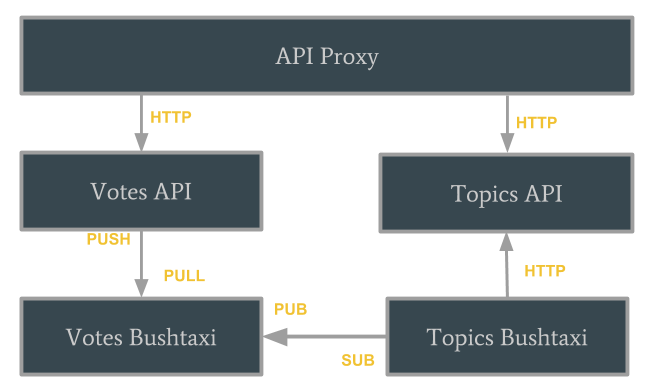

# bushtaxi-demo
This repository demonstrates how [bushtaxi](https://github.com/moee/bushtaxi) can be used to create microservices in PHP that communicate with each other using ZeroMQ.

## Installation

`docker-compose -f docker-compose-install.yml up`

## Run it

`docker-compose up`

## What does it do?

If you run `docker-compose up`, 5 services will be started:

* topics api 
* votes api
* topics bushtaxi
* votes bushtaxi
* proxy

The communication flows like this



The idea is that the topics service maintains a sum of the total up/downvotes for each topic. So whenever a vote is casted the respective topic count gets updated.

### Step by Step

#### Prerequisites

1. Load the demo topics `curl -XPOST --data "@topics/topics.json" http://127.0.0.1/topics`
2. Verify that the topics are loaded: `curl http://127.0.0.1/topics`
3. Show that patching works: `curl -XPATCH --data '{ "votes": 1 }' http://127.0.0.1/topics/1`
4. The topic with id 1 now has 1 vote: `curl http://127.0.0.1/topics/1`

#### Communication

4. Now, cast a vote: `curl -XPOST --data '{ "topic_id" : 1, "vote" : 1 }"' http://127.0.0.1/votes`
5. "Magically" the vote for topic id 1 was updated: `curl http://127.0.0.1/topics/1`

#### How did this work?

`docker-compose logs` shows us what was going on

##### Step 1: [The votes api pushed a message to the votes bushtaxi](./votes/api/src/BushtaxiDao.php)
```
votes_api_1        | Establish push ZMQSocket for bushtaxi [] []
votes_api_1        | handle_push from bushtaxi [] []
votes_api_1        | handle_connect [] []
votes_api_1        | connect bushtaxi to tcp://10.0.3.101:6000 [] []
votes_api_1        | connected bushtaxi to tcp://10.0.3.101:6000 [] []
votes_api_1        | Send message vote.casted to bushtaxi [] []
votes_api_1        | Send vote object to bushtaxi [] []
votes_api_1        | api.DEBUG: Done [] []
```
##### Step 2: [The votes bushtaxi pulled the message and sent out an event](./votes/bushtaxi/src/run.php)
```
votes_bushtaxi_1   | Listening for event from api [] []
votes_bushtaxi_1   | Received message vote.casted [] []
votes_bushtaxi_1   | Listening for payload from api [] []
votes_bushtaxi_1   | Received message {"id":"4072998","topic_id":"1","vote":"1"} [] []
votes_bushtaxi_1   | Publishing event vote.casted [] []
votes_bushtaxi_1   | Sending payload [] []
votes_bushtaxi_1   | Done [] []
votes_bushtaxi_1   | Listening for event from api [] []
```

##### Step 3: [The topics bushtaxi received the event](./src/topics/bushtaxi/run.php) and made a rest request to topics

```
topics_bushtaxi_1  | Listening for event from votes [] []
topics_bushtaxi_1  | Received event vote.casted [] []
topics_bushtaxi_1  | Listening for payload from votes [] []
topics_bushtaxi_1  | Received {"id":"edd71cc","topic_id":"1","vote":"1"} [] []
topics_bushtaxi_1  | Patching topics api [] []
topics_bushtaxi_1  | Done [] []
```
